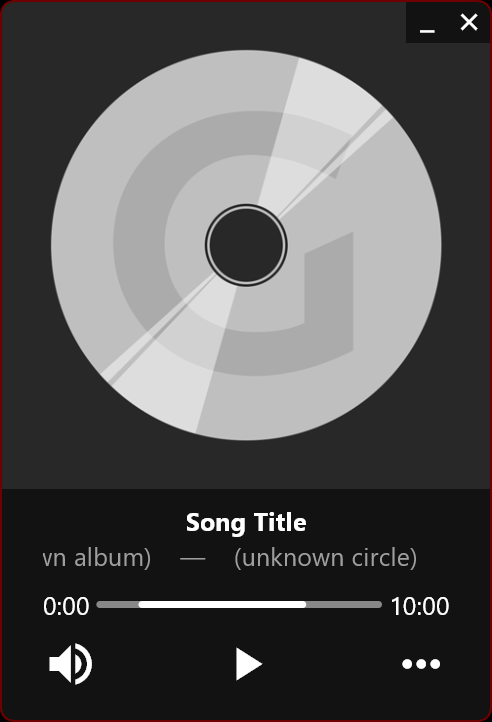
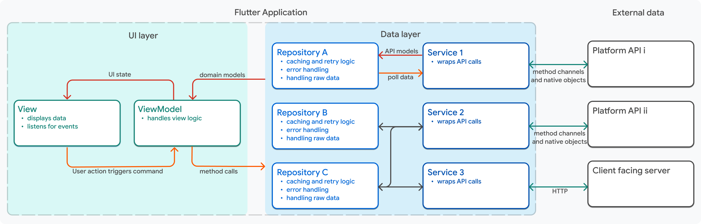
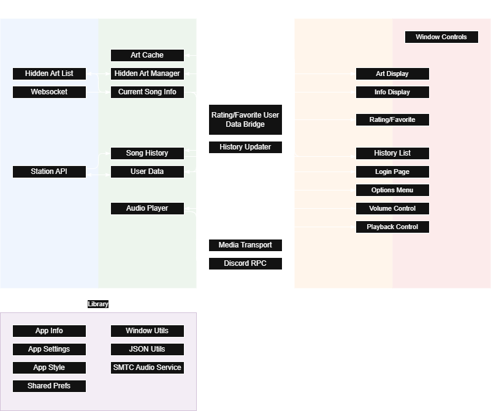
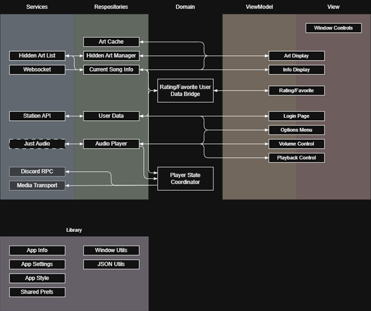

---
# Feel free to add content and custom Front Matter to this file.
# To modify the layout, see https://jekyllrb.com/docs/themes/#overriding-theme-defaults

layout: default
title: "SNHU ePortfolio"
---

# SNHU ePortfolio

> The GitHub repository for my project is at **[Fenekhu/gr-miniplayer](https://github.com/Fenekhu/gr-miniplayer)** if you would like to try the player or view the project.  

Contents:

- [SNHU ePortfolio](#snhu-eportfolio)
  - [Introduction](#introduction)
  - [Background](#background)
  - [Week One: Planning](#week-one-planning)
  - [Week Two: Reviewing My Previous Project](#week-two-reviewing-my-previous-project)
  - [Week Three](#week-three)
    - [Window Manager Package Bug](#window-manager-package-bug)
    - [Linux Shared Library Bugs](#linux-shared-library-bugs)
    - [Just Audio vs Media Kit](#just-audio-vs-media-kit)
    - [Using the Station API](#using-the-station-api)
    - [Hot Reloading and Stateless Widgets](#hot-reloading-and-stateless-widgets)
    - [Updating the UI When Logging In or Out](#updating-the-ui-when-logging-in-or-out)
    - [Conclusion](#conclusion)

## Introduction

For this project, I created a compact desktop player for an internet radio station I listen to often. This was a project I had attempted in the past, but failed for a number of reasons. In this project I was able to complete the project, learn a lot a long the way, and meet both personal and educational goals.

- Personal Goals:
  - Finish a project
  - Develop a cross-platform desktop app
  - Make something useful
  - Have a clean, well-architected, well-organized, well-documented code base
- Educational Goals (Course Outcomes):
  - Employ strategies for building collaborative environments that enable diverse audiences to support organizational decision making in the field of computer science
  - Design, develop, and deliver professional-quality oral, written, and visual communications that are coherent, technically sound, and appropriately adapted to specific audiences and contexts
  - Design and evaluate computing solutions that solve a given problem using algorithmic principles and computer science practices and standards appropriate to its solution, while managing the trade-offs involved in design choices
  - Demonstrate an ability to use well-founded and innovative techniques, skills, and tools in computing practices for the purpose of implementing computer solutions that deliver value and accomplish industry-specific goals
  - Develop a security mindset that anticipates adversarial exploits in software architecture and designs to expose potential vulnerabilities, mitigate design flaws, and ensure privacy and enhanced security of data and resources

\<Professional self-assessment goes here\>

## Background

I often listen to an internet radio station - Gensokyo Radio - through [their website](https://app.gensokyoradio.net). I like my music player to take up as little space on my second screen as possible. As nice as their web app is, it doesn't scale down well, and a lot of extra space is required by the browser window. I wanted to make something more compact that could be used by others on any desktop platform. After researching a variety of options, I settled on Flutter, an app development framework by Google, due to its ability to compile directly to native code, low overhead, thorough documentation, and healthy package ecosystem. I also contacted the station owner to confirm that it would be okay to do this project, which it was (given a few guidelines I was able to easily follow).  

Unfortunately, I didn't get very far. I made a prototype UI with an audio player that would play a default UK-based broadcast, but never connected it to Gensokyo Radio in any way. Although I had spent a fair bit of time learning Dart, Flutter, and a number of libraries I planned to use, I jumped straight into coding. With the project not even half finished, progress became impossible due to high-level disorganization, with no underlying structure, architecture, or patterns. It wasn't something that could be fixed with a few refactorings, I needed to restart from scratch, building structure in from the very beginning.  

  

*The prototype UI from the initial project.*

## Week One: Planning

To start planning properly from the beginning, I drafted an initial list of features I wanted in my player app. This initial set of business and technical features would end up changing over the course of the project, such as by adding integration with OS media controls, discord rich presence, and a history list.  

- An audio player and audio player controls.
- Connecting to a websocket to receive live song information.
- Connecting an audio player to a chunked HTTP stream source.
- Use the station's REST API for user login sessions.
  - To submit song ratings and save songs to favorites.
  - For access to the paywalled high-quality audio stream.
- A way to blur a specific album's art now and in the future (some art on the station makes me uncomfortable).
- Cross-platform code, tools, and compilation to be natively usable by Windows, Mac, and Linux users (ie, no wine/emulation necessary).
- Start with architecture and design first, before I begin coding, to prevent running into the same issues.

The first place I went to give my application some structure was the Flutter documentation, which had an architecture guide that I had previously skipped. The guide detailed the Model View ViewModel (MVVM) architecture pattern, which Flutter is particularly well suited to. Though I was aware of Model View Controller (MVC) architecture, I lacked a practical understanding of its implementation. On the other hand, this diagram from the documentation, combined with a number of communication and relationship 'rules' between layers and components, made the idea of MVVM architecture click for me.  

[](https://docs.flutter.dev/app-architecture/guide#mvvm)

With this as a base, I came up with a list of 40-ish elements across the different layers to reach all the features I had planned for the app. I turned this list into a flowchart similar to the one above, illustrating the location of each component within the architecture, as well as the flow of communications between them. I modified the diagram frequently throughout development, so unfortunately I don't have this initial version anymore, but here is the current (and likely final) state of the diagram. Note that it is "backwards" compared to the diagram above. Also, because Views and ViewModels were in a 1-1 relation (except for the window controls, which needed no viewmodel), I chose to draw them as a single box spanning both categories to keep the diagram cleaner. In the code base, they have been separated into two separate classes and files.



## Week Two: Reviewing My Previous Project

If the embed above doesn't work: [my code review (YouTube)](https://youtu.be/7H-Mbs2Q4rk?si=o7l9j7XTFrZjRMr8). The code files from the initial project are available [here](https://github.com/Fenekhu/snhu-eportfolio/tree/main/assets/initial-project-code).

While what little functionality there was within my previous project was junk, I knew a fair amount of the UI would be salvagable. It would need tweaking to handle the new patterns of communication I planned to handle application state with, such as streams and dependency injection. Some UI components were so intertwined with the functionality and state that they had to becompletely rewritten.  

In addition to salvaging code, I also wanted to identify bad practices, inconsistent style, and other issues within my usage of Dart and Flutter, to avoid similar mistakes and keep my new project clean. For example, there are roughly zero code comments in my original project, but the new project is almost fully documented where the code isn't self-documenting (which I try to do as much as possible).

Another example of something that was cleanly rewritten is in [`stream_endpoint.dart`](https://github.com/Fenekhu/snhu-eportfolio/blob/main/assets/initial-project-code/stream_endpoint.dart):

*For background, the radio stream is available at four different qualities, all with different URLs. In the initial project, I was just using test endpoints instead of the actual stream. If I accidentally made a mistake that spammed the url with requests, I wouldn't want to get my IP blacklisted from the station I often listen to.*

```dart
class StreamEndpoint {
  final String name;
  final String url;
  const StreamEndpoint({required this.name, required this.url});

  // toString, equality, and hash operators omitted

  static const List<StreamEndpoint> list = [
    StreamEndpoint(name:   "Mobile (64k Opus)", url: "http://localhost:8000/stream"),
    StreamEndpoint(name: "Standard (128k mp3)", url: "http://localhost:8000/stream"),
    StreamEndpoint(name:     "High (256k mp3)", url: "https://stream-uk1.radioparadise.com/aac-320"),
    StreamEndpoint(name:     "Lossless (FLAC)", url: "https://stream-uk1.radioparadise.com/aac-320"),
  ];
}
```

The class here clearly represents an enumerated set of constant objects, but for some reason I didn't make this an enum. This was easily refactored into a more sensible [Dart enum in the final project](https://github.com/Fenekhu/gr-miniplayer/blob/main/lib/util/enum/stream_endpoint.dart):

```dart
// yes, 2 and 1 are backwards like that, because historically there was only one endpoint (Standard /1/).
enum StreamEndpoint {
    mobile(value: '2', name: 'Mobile',   desc: '64k Opus'),
  standard(value: '1', name: 'Standard', desc: '128k mp3'),
      high(value: '3', name: 'High',     desc: '256k mp3'),
  lossless(value: '4', name: 'Lossless', desc: 'FLAC'    ),
  ;

  final String value;
  final String name;
  final String desc;

  Uri get uri => Uri.parse('https://stream.gensokyoradio.net/$value/');

  const StreamEndpoint({required this.value, required this.name, required this.desc});

  static StreamEndpoint fromValue(String value) => switch (value) {
    '2' => StreamEndpoint.mobile,
    '1' => StreamEndpoint.standard,
    '3' => StreamEndpoint.high,
    '4' => StreamEndpoint.lossless,
     _  => StreamEndpoint.standard,
  };
}
```

After completing this code review, I began work on rewriting and implementing the bulk of the functionality.

## Week Three

By the end of the third week, I had implemented a majority of the features I began in the previous week. At this point, my diagram looked like this:



*The dashed line around the Just Audio component was meant to signify that it was a component from a library and not my own, but I decided to omit it from my final diagram for that same reason. The greyed out Discord RPC and Media Transport components signify those were planned but not yet implemented, as I had little experience with using either, and would need some research before implementing.*

Throughout the process of implementing the features just up to this point, I’ve been able to see my own growth in many areas. For example, I ran into many issues that would have made a younger me, even by only a year or two, give up. Some of these issues have been due to bugs in dependencies, which have made younger me say “welp, I can’t do anything about it. Guess the project is over”. But I now know that isn’t true. Developers must find workarounds for bugs in dependencies all the time. I’ve also seen growth in code style consistency, something which I’ve also long struggled with, and though I’m still not perfect, I also don’t expect myself to have perfectly consistent style in my first project in a language with complex indentation and new-line practices. Related to code style, I also have noticed an improvement in code documentation. Not only have I gotten better at more frequently writing comments (especially ones that are useful), but I’ve also gotten better at writing clearer “self-documenting” code, using descriptive variable and function names, language constructs, and paradigms.

To list most of the specific challenges I got caught up in up to this point:

### Window Manager Package Bug

There is an issue with a package that allows moving and resizing windows not working properly with high-resolution monitors. I [reported this issue](https://github.com/leanflutter/window_manager/issues/536) to the package authors, but found I was able to work around the issue by manually adjusting the calculations. Unfortunately, I’ve noticed that the issue is not consistent or predictable, but more often than not, the window is now correctly sized and placed.

### Linux Shared Library Bugs

The application would not launch on my Ubuntu Linux VM. Just Audio provides an audio player interface, but only provides platform implentations for MacOS, iOS, and Android. Windows and Linux must use external package implementations. I settled on `just_audio_windows` for Windows and `just_audio_media_kit` for Linux. After doing this, I discovered that the Media Kit implementation not only worked on Windows and MacOS, but was better than the other implementations. However, it ironically did not work on Linux, crashing on initialization. The issue seemed to be an issue not with Media Kit or the Media Kit implementation, but rather with my installation of Linux itself. I spent a lot of time trying to understand the issue, but I ultimately ended up fixing it by switching from an Ubuntu VM to a Debian VM. You can read much more in depth about what happened in [my reddit post asking for help](https://www.reddit.com/r/linuxquestions/comments/1jdp1ng/confusion_about_an_issue_with_shared_libraries_i/?utm_source=share&utm_medium=web3x&utm_name=web3xcss&utm_term=1&utm_content=share_button).

### Just Audio vs Media Kit

After spending most of a week trying to sort out the issues with Linux, it occurred to me that if Media Kit is a cross-platform audio-playing package, I could use it without the Just Audio wrapper around it. In an effort to try to simplify my projects dependencies, I began switching the player implementation from Just Audio to Media Kit. Media Kit’s audio player interface was somewhat low level and primitive. While it could provide all the information my app needed, I was spending a lot of effort trying to combine that information into something my app could use. It didn’t take long for me to realize that this was almost exactly what Just Audio was doing. So, I abandoned the switch to Media Kit once I realized that somebody had already done that work for me: the Just Audio package.

### Using the Station API

The last thing I had to do before I was ready to submit my progress at the end of the week was to add a login page and buttons for rating and favoriting a song. For the most part this went smoothly, but then I discovered that the station’s API isn’t consistent in the format that it returns results. Sometimes a response will be a single JSON object wrapped in an array, and other times not. Sometimes a field will have a value that is an integer wrapped as a string, and other times that same value is just an integer. I had to spend a bit of time thinking about how to parse these responses in a clean way, and this led to the creation of the [`json_utils`](https://github.com/Fenekhu/gr-miniplayer/blob/main/lib/util/lib/json_util.dart) library.

As I was testing the station API, I was using Flutter’s DevTools to monitor network activity from my app. I noticed that there was some strange behavior regarding duplicated network activity. One issue I will address in the next section, but another issue was caused by the station’s API returning 301 redirects to non-https URLs, which in a browser would get upgraded back to https status and then work fine. I thought it was strange that the API URL was correct, yet it was redirecting. I discovered that it was because my API URLs didn’t end with a trailing slash. After discussing with the station owner, I found out that the no-trailing-slash redirect was intended, but the http downgrade was not, and they were able to get that fixed.

### Hot Reloading and Stateless Widgets

While monitoring my apps network activity, I discovered that many requests were being duplicated. Album art was being fetched multiple times, ratings were sent and retrieved multiple times, and these were all bad signs. I discovered it was caused by a convenient capability of Flutter called *hot reloading*, where it can apply code changes while the app is running. In the process, new viewmodels are created, but the old ones were not being released and still receiving UI events that would cause duplicated image loads and API requests. I was able to fix this by implementing caching in the repositories, but I suspect that this is a deeper issue stemming from my reluctance to use stateful widgets.

### Updating the UI When Logging In or Out

Just as I was about to submit the progress update, I noticed that the UI would not properly respond to login or logout events. When logged in, the settings menu should display “Logout”, and vice versa. When logged out, the rating and favorite buttons should be disabled, and the rating/favorite status should be fetched for the current song when a user logs in. I found that not only was the UI not updating when it should have been, I also had no mechanism in place to fetch new rating data after a log in. Like the caching issue above, I couldn’t rely on the login process to initiate that update, as it would be duplicated after a hot reload. Because of this, I had to add a domain model to fetch the current rating status both when the song changes and when the log in state changes. This didn’t fix the issue of the UI updating unfortunately. I was able to fix that issue easily when I realized that widgets that respond to stream events only receive events when they are visible and otherwise will be constructed from empty events. I was able to provide a cached login state to construct these widgets properly.

### Conclusion

Overall, I was very happy with the way that this project was going at this point. I had seen my own growth and done things I had never been able to do before. I had accomplished everything I had set out to accomplish for by the end of the week. I’ve not only met many of my own personal goals but managed to do so in a way that demonstrates all of the course outcomes in a single milestone:

- Employ strategies for building collaborative environments that enable diverse audiences to support organizational decision making in the field of computer science.
  - A clean project architecture makes collaboration easier, such as by reducing cognitive load when understanding structures by following a known pattern (MVVM). Additionally, a clean architecture can reduce the amount of effort required to add new, unexpected features, something I experienced personally throughout the course of development.
  - I ran into a few issues in development, some requiring me to reach beyond my own expertise and seek help from the community. Additionally, in searching for cross platform solutions to problems, I’ve used advice from forums on what packages/libraries to use. While these sources aren’t organizational, the nature of using collaborative external input to influence my decisions is applicable here.
- Design, develop, and deliver professional-quality oral, written, and visual communications that are coherent, technically sound, and appropriately adapted to specific audiences and contexts
  - A good project architecture will naturally lend itself to being simplified into clean, organized diagrams that represent the application. This can lead to detailed, structured documentation and easy communication to less technical audiences. This is reflected in the diagram I created.
  - Additionally, since I had been experiencing issues, I practiced professional communication in the form of GitHub issues and direct communication with people.
- Design and evaluate computing solutions that solve a given problem using algorithmic principles and computer science practices and standards appropriate to its solution, while managing the trade-offs involved in design choices.
  - In the process of implementing most of the features, I had to make many design choices between comparable solutions to various problems. For example:
    - Handling communication between components. Flutter has multiple ways of syncing UI with state, from Listeners to Notifiers to even more complex packages. I decided to go with a native Dart language construct called Streams (similar to Observables in other languages). I chose this because of the built-in support in Flutter, and many libraries provide their data through streams, minimizing additional processing needed. The drawback was that streams followed *functional programming* principles, something which I was largely unfamiliar with. Despite this, I decided it would be better to get used to functional programming than learn a niche Flutter-specific state management API.
    - What data structure to use for the list of albums whos art should be hidden. As I keep calling it a *list*, the natural inclination would be to use a List, but the actual requirements are that of a Set: there should be no duplicates, and element order has no meaning. That said, I also ensured that the set used either ordered storage or hashes storaged to be able to perform at least `O(log n)` element lookups. It uses hashes, which are `O(1)`.
    - Converting arbitrary data types. As detailed in the [Using the Station API](#using-the-station-api) section, JSON data retrieved from the server was in an inconsistent format, and JSON in its nature is not easily compatible with statically typed languages like Dart. This lead to a lot of runtime parsing issues, which required creative solutions to overcome. The primary approach was to convert a value of an unknown type to a string (which is supported for all primitive types) then parse it back to the primitive. Special considerations had to be made to not convert missing values into the string `"null"`.
- Demonstrate an ability to use well-founded and innovative techniques, skills, and tools in computing practices for the purpose of implementing computer solutions that deliver value and accomplish industry-specific goals.
  - Similar to the previous outcome, there were many considerations made along the way for the right tool for the job.
    - Flutter is a known, widely used application framework developed and maintained by Google. It is a low-risk framework with lots of support and a stable future. I chose Flutter because it offers native compilation to the various desktop platforms I wanted to support with very little overhead, as well as being fast, free, and easy to use. Other frameworks I considered but decided against were: Electron (lots of overhead, contains an entire instance of chromium), Qt (not free I think? Very confusing to use), .NET MAUI (lack of documentation), and React Native (didn’t have the functionality I needed).
    - A big focus of this project is supporting multiple platforms. Flutter itself is made to support cross-platform development, and I’m relying on packages that support multiple platforms to provide additional functionality. This has required a lot of research into which packages provide the best toolset and minimal setup requirements for cross platform solutions. For example, initially, I wanted to use the Just Audio flutter package for audio. Then I found out that the best Linux implementation of Just Audio uses another package called Media Kit, which itself is a cross-platform audio player that works better on Window and Mac than Just Audio, so began switching my implementation to Media Kit. Eventually, I decided to stay with Just Audio because it provides a better interface.
- Develop a security mindset that anticipates adversarial exploits in software architecture and designs to expose potential vulnerabilities, mitigate design flaws, and ensure privacy and enhanced security of data and resources.
  - This project involves web communication, including login credentials and session management. Proper handling of these are a critical area of security in application development, so care was taken from the design phase to address these concerns. This includes: Not storing credentials, safe session storage, web communication abstraction and failsafes, and external data validation.
  - Throughout development itself, I’ve been protecting the various servers my player interacts with from accidental DoS’s when unexpected issues arise (like not rapidly attempting reconnects on connection errors).
