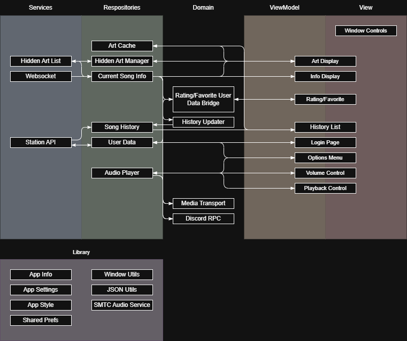

---
# Feel free to add content and custom Front Matter to this file.
# To modify the layout, see https://jekyllrb.com/docs/themes/#overriding-theme-defaults

layout: default
title: "SNHU ePortfolio"
---

# SNHU ePortfolio

> **Important:** The GitHub repository for my project is at **[Fenekhu/gr-miniplayer](https://github.com/Fenekhu/gr-miniplayer)**. There are compiled binaries as well as build instructions if you would like to try it yourself. Code files are located under the [`/lib/` directory](https://github.com/Fenekhu/gr-miniplayer/tree/main/lib).  

Contents:

- [SNHU ePortfolio](#snhu-eportfolio)
  - [Introduction](#introduction)
    - [Project Significance](#project-significance)
    - [My Project is Different](#my-project-is-different)
  - [The Process](#the-process)
    - [Background](#background)
    - [Planning (Week One)](#planning-week-one)
    - [Reviewing My Previous Project (Week Two)](#reviewing-my-previous-project-week-two)
    - [Development (Week 2-5)](#development-week-2-5)
      - [Roadblocks](#roadblocks)
        - [Window Manager Package Bug](#window-manager-package-bug)
        - [Linux Shared Library Bugs](#linux-shared-library-bugs)
        - [Just Audio vs Media Kit](#just-audio-vs-media-kit)
        - [Using the Station API](#using-the-station-api)
        - [Hot Reloading and Stateless Widgets](#hot-reloading-and-stateless-widgets)
        - [Updating the UI When Logging In or Out](#updating-the-ui-when-logging-in-or-out)
        - [Connecting `smtc_windows` to `audio_service`](#connecting-smtc_windows-to-audio_service)
        - [Image Caching and Asynchrony issues](#image-caching-and-asynchrony-issues)
    - [Testing (Week 5-6)](#testing-week-5-6)
    - [Deployment (Week 6)](#deployment-week-6)
  - [Conclusion](#conclusion)
    - [Outcome One](#outcome-one)
    - [Outcome Two](#outcome-two)
    - [Outcome Three](#outcome-three)
    - [Outcome Four](#outcome-four)
    - [Outcome Five](#outcome-five)

## Introduction

For this project, I created a compact desktop player for an internet radio station I listen to often. This was a project I had attempted in the past but failed for several reasons. In this course I was able to complete the project, learn a lot along the way, and meet both personal and educational goals.

- Personal Goals:
  - Finish a project
  - Develop a cross-platform desktop app
  - Make something useful
  - Have a clean, well-architected, well-organized, well-documented code base
- Educational Goals (Course Outcomes):
  - Employ strategies for building collaborative environments that enable diverse audiences to support organizational decision making in the field of computer science
  - Design, develop, and deliver professional-quality oral, written, and visual communications that are coherent, technically sound, and appropriately adapted to specific audiences and contexts
  - Design and evaluate computing solutions that solve a given problem using algorithmic principles and computer science practices and standards appropriate to its solution, while managing the trade-offs involved in design choices
  - Demonstrate an ability to use well-founded and innovative techniques, skills, and tools in computing practices for the purpose of implementing computer solutions that deliver value and accomplish industry-specific goals
  - Develop a security mindset that anticipates adversarial exploits in software architecture and designs to expose potential vulnerabilities, mitigate design flaws, and ensure privacy and enhanced security of data and resources

### Project Significance

I chose this project because it showcased a set of skills that have taken me a long time to build, much longer than it has taken me to learn any programming language, framework, or algorithm. The first of three overarching skills I want to highlight is the ability to create and finish a usable product effectively and efficiently within a timeframe. In my experience, I have talked to many CS students and programming enthusiasts who *know* lots about computer science topics, like floating point versus fixed point numbers, this algorithm versus that algorithm, the linux environment, etc., but few can show me something they have done with all that knowledge that goes beyond personal use. I rarely find someone who has created something that other people can pick up and use without direct guidance, much less a whole application. This isn't to cast doubt on the usefulness of that knowledge, but rather to highlight the leap between answering questions on a test or replacing a few stubs in code, and applying that knowledge practically. Not only is there a difference between recollection and application, but there is also knowledge specific to creating a user-focused application that goes beyond what most schools teach and test: version control, accessibility, usage documentation, user feedback and user-centric design, application presentation, packaging and deployment, open source licensing, and maybe most importantly, how to get around development roadblocks.  

That brings me to my second overarching skill: problem solving. This is a skill everyone possesses to some extent, and it is just as general as "a problem" can be. In school, problems and solutions are often given in pairs to train students to be able to solve similar problems in the future. Obviously, no education could completely prepare someone for every problem they encounter, especially in a field as deep as technology. In that way, the ability to self-diagnose, understand, and solve new problems is an invaluable skill to a developer. This is a skill I have been building from my earliest days on a computer, beginning with reading modded Minecraft crash reports. No project goes perfectly smoothly, especially within computer science, and even more so when working with new technologies like I did in this project. The story of this project highlights the many novel problems I ran into along the way, and how I addressed them.  

Lastly, Similar to the ability to solve problems with new technologies is the ability to learn. Like problem solving, schools focus more on the content being learnt or the problems being solved than the process of doing either. An education won't teach someone everything there is to know about something as broad as computer science, so it is up to the individual to fill in the gaps as needed. It is unlikely that I will find a job that exclusively uses the "basic" set of tools, languages, and platforms I used throughout the computer science program. Even if I spent my own time learning more tools, a job position would still likely require knowing something I've never used. That said, learning involves drawing connections to previous knowledge, so by taking the time to learn tools and frameworks and languages that I may never need directly, I get better at both foundational skills and learning quickly again in the future. For that reason, the ability to self-teach at a deep level, deep enough to implement that knowledge practically, is also an invaluable skill within the industry.

While I could (and later will) go deeper into the specific skills related to the features I implemented in this application, these overarching skills should demonstrate that the smaller skills aren't what makes this project impressive.

### My Project is Different

The primary focus of this capstone course is supposed to be the enhancement of one to three artifacts in a set of categories (design, structures and algorithms, and databases). Howver, instead of focusing on categorical enhancements, I chose to demonstrate the course outcomes through building a single application mostly from scratch using what I learned from my previous attempt. I did this project differently because I thought it showcased better the larger skills mentioned above, which I am personally most proud of, as well as meeting the personal goals I outlined earlier. By doing it successfully this time, I was able to demonstrate personal progress, self-reflection, and the ability to learn from failures. Care was also taken to ensure that I would meet the course outcomes despite my unconventional approach.  

Because development was a single cohesive project instead of three separate enhancement categories, it doesn't make sense to break down how I met the course outcomes between each milestone, but rather how I did through the entire process. This breakdown will be at the end of this document.

## The Process

### Background

I often listen to an internet radio station - Gensokyo Radio - through [their website](https://app.gensokyoradio.net). I like my music player to take up as little space on my second screen as possible. As nice as their web app is, it doesn't scale down well, and a lot of extra space is required by the browser window. I wanted to make something more compact that could be used by others on any desktop platform. After researching a variety of options, I settled on Flutter, an app development framework by Google, due to its ability to compile directly to native code, low overhead, thorough documentation, and healthy package ecosystem. I also contacted the station owner to confirm that it would be okay to do this project, which it was (given a few guidelines I was able to easily follow).  

Unfortunately, I didn't get very far. I made a prototype UI with an audio player that would play a default UK-based broadcast but never connected it to Gensokyo Radio in any way. Although I had spent a fair bit of time learning Dart, Flutter, and a few libraries I planned to use, I jumped straight into coding. With the project not even half finished, progress became impossible due to high-level disorganization, with no underlying structure, architecture, or patterns. It wasn't something that could be fixed with a few refactorings. I needed to restart from scratch, building structure in from the very beginning.  

  

*The prototype UI from the initial project.*

### Planning (Week One)

To start planning properly from the beginning, I drafted an initial list of features I wanted in my player app. This initial set of business and technical features would end up changing over the course of the project, such as by adding integration with OS media controls, discord rich presence, and a history list.  

- An audio player and audio player controls.
- Connecting to a websocket to receive live song information.
- Connecting an audio player to a chunked HTTP stream source.
- Use the station's REST API for user login sessions.
  - To submit song ratings and save songs to favorites.
  - For access to the paywalled high-quality audio stream.
- A way to blur a specific album's art now and in the future (some art on the station makes me uncomfortable).
- Cross-platform code, tools, and compilation to be natively usable by Windows, Mac, and Linux users (ie, no wine/emulation necessary).
- Start with architecture and design first, before I begin coding, to prevent running into the same issues.

The first place I went to give my application some structure was the Flutter documentation, which had an architecture guide that I had previously skipped. The guide detailed the Model View ViewModel (MVVM) architecture pattern, which Flutter is particularly well suited to. Though I was aware of Model View Controller (MVC) architecture, I lacked a practical understanding of its implementation. On the other hand, this diagram from the documentation, combined with a few communication and relationship 'rules' between layers and components, made the idea of MVVM architecture click for me.  

[](https://docs.flutter.dev/app-architecture/guide#mvvm)

With this as a base, I came up with a list of 40-ish elements across the different layers to reach all the features I had planned for the app. I turned this list into a flowchart like the one above, illustrating the location of each component within the architecture, as well as the flow of communications between them. I modified the diagram frequently throughout development, so unfortunately, I don't have this initial version anymore. Instead, here is the current (and likely final) state of the diagram. Note that it is "backwards" compared to the diagram above. Also, because Views and ViewModels were in a 1-1 relation (except for the window controls, which needed no viewmodel), I chose to draw them as a single box spanning both categories to keep the diagram cleaner. In the code base, they have been separated into two separate classes and files.



### Reviewing My Previous Project (Week Two)

If the embed above doesn't work: [my code review (YouTube)](https://youtu.be/7H-Mbs2Q4rk?si=o7l9j7XTFrZjRMr8). The code files from the initial project are available [here](https://github.com/Fenekhu/snhu-eportfolio/tree/main/assets/initial-project-code).

While what little functionality there was within my previous project was junk, I knew a fair amount of the UI would be salvageable. It would need tweaking to handle the new patterns of communication for handling application state, such as streams and dependency injection. Some UI components were so intertwined with the functionality and state that they had to be completely rewritten.  

In addition to salvaging code, I also wanted to identify bad practices, inconsistent style, and other issues within my usage of Dart and Flutter, to avoid similar mistakes and keep my new project clean. For example, there are roughly zero code comments in my original project, but the new project is almost fully documented where the code isn't self-documenting (which I try to do as much as possible).

Another example of something that was cleanly rewritten is in [`stream_endpoint.dart`](https://github.com/Fenekhu/snhu-eportfolio/blob/main/assets/initial-project-code/stream_endpoint.dart):

*For background, the radio stream is available at four different qualities, all with different URLs. In the initial project, I was just using test endpoints instead of the actual stream. If I accidentally made a mistake that spammed the URL with requests, I wouldn't want to get my IP blacklisted from the station I often listen to.*

```dart
class StreamEndpoint {
  final String name;
  final String url;
  const StreamEndpoint({required this.name, required this.url});

  // toString, equality, and hash operators omitted

  static const List<StreamEndpoint> list = [
    StreamEndpoint(name:   "Mobile (64k Opus)", url: "http://localhost:8000/stream"),
    StreamEndpoint(name: "Standard (128k mp3)", url: "http://localhost:8000/stream"),
    StreamEndpoint(name:     "High (256k mp3)", url: "https://stream-uk1.radioparadise.com/aac-320"),
    StreamEndpoint(name:     "Lossless (FLAC)", url: "https://stream-uk1.radioparadise.com/aac-320"),
  ];
}
```

The class here clearly represents an enumerated set of constant objects, but for some reason I didn't make this an enum. This was easily refactored into a more sensible [Dart enum in the final project](https://github.com/Fenekhu/gr-miniplayer/blob/main/lib/util/enum/stream_endpoint.dart):

```dart
// yes, 2 and 1 are backwards like that, because historically there was only one endpoint (Standard /1/).
enum StreamEndpoint {
    mobile(value: '2', name: 'Mobile',   desc: '64k Opus'),
  standard(value: '1', name: 'Standard', desc: '128k mp3'),
      high(value: '3', name: 'High',     desc: '256k mp3'),
  lossless(value: '4', name: 'Lossless', desc: 'FLAC'    ),
  ;

  final String value;
  final String name;
  final String desc;

  Uri get uri => Uri.parse('https://stream.gensokyoradio.net/$value/');

  const StreamEndpoint({required this.value, required this.name, required this.desc});

  static StreamEndpoint fromValue(String value) => switch (value) {
    '2' => StreamEndpoint.mobile,
    '1' => StreamEndpoint.standard,
    '3' => StreamEndpoint.high,
    '4' => StreamEndpoint.lossless,
     _  => StreamEndpoint.standard,
  };
}
```

After completing this code review, I began work on rewriting and implementing the bulk of the functionality.

### Development (Week 2-5)

By the end of the third week, I had implemented many of the features I began after the review process in the previous week. At this point, my diagram looked like this:


*The dashed line around the Just Audio component was meant to signify that it was a component from a library and not my own, but I decided to omit it from my final diagram for that same reason. The greyed-out Discord RPC and Media Transport components signify those were planned but not yet implemented, as I had little experience with using either and would need to do some research prior to their implementation.*

Throughout the process of implementing the features up to the end of week three, I was able to see my own growth in many areas. For example, I ran into many issues that would have made a younger me, even by only a year or two, give up. Some of these issues have been due to bugs in dependencies, which would have made a younger me say “welp, I can’t do anything about it. Guess the project is over”. But I now know that isn’t true. Developers must find workarounds for bugs in dependencies all the time. I’ve also seen growth in code style consistency, something which I’ve also long struggled with, and though I’m still not perfect, I also don’t expect myself to have perfectly consistent style in my first project in a language with complex indentation and new-line practices. Related to code style, I also have noticed an improvement in code documentation. Not only have I gotten better at more frequently writing comments (especially ones that are useful), but I’ve also gotten better at writing clearer “self-documenting” code, using descriptive variable and function names, language constructs, and paradigms.

#### Roadblocks

To list most of the specific challenges I got caught up in:

##### Window Manager Package Bug

There is an issue with a package that allows moving and resizing windows not working properly with high-resolution monitors. I [reported this issue](https://github.com/leanflutter/window_manager/issues/536) to the package authors, but found I was able to work around the issue by manually adjusting the calculations. Unfortunately, I’ve noticed that the issue is not consistent or predictable, but more often than not, the window is now correctly sized and placed.

##### Linux Shared Library Bugs

The application would not launch on my Ubuntu Linux VM. Just Audio provides an audio player interface, but only provides platform implementations for MacOS, iOS, and Android. Windows and Linux must use external package implementations. I settled on `just_audio_windows` for Windows and `just_audio_media_kit` for Linux. After doing this, I discovered that the Media Kit implementation not only worked on Windows and MacOS but was better than the other implementations. However, it ironically did not work on Linux, crashing on initialization. The issue seemed to be an issue not with Media Kit or the Media Kit implementation, but rather with my installation of Linux itself. I spent a lot of time trying to understand the issue, but I ultimately ended up fixing it by switching from an Ubuntu VM to a Debian VM. You can read much more in depth about what happened in [my reddit post asking for help](https://www.reddit.com/r/linuxquestions/comments/1jdp1ng/confusion_about_an_issue_with_shared_libraries_i/?utm_source=share&utm_medium=web3x&utm_name=web3xcss&utm_term=1&utm_content=share_button).

##### Just Audio vs Media Kit

After spending most of a week trying to sort out the issues with Linux, it occurred to me that if Media Kit is a cross-platform audio-playing package, I could use it without the Just Audio wrapper around it. To try to simplify my projects dependencies, I began switching the player implementation from Just Audio to Media Kit. Media Kit’s audio player interface was somewhat low level and primitive. While it could provide all the information my app needed, I was spending a lot of effort trying to combine that information into something my app could use. It didn’t take long for me to realize that this was almost exactly what Just Audio was doing. So, I abandoned the switch to Media Kit once I realized that somebody had already done that work for me via the Just Audio package.

##### Using the Station API

The last thing I had to do before I was ready to submit my progress at the end of the week was to add a login page and buttons for rating and favoriting a song. For the most part this went smoothly, but then I discovered that the station’s API isn’t consistent in the format that it returns results. Sometimes a response will be a single JSON object wrapped in an array, and other times not. Sometimes a field will have a value that is an integer wrapped as a string, and other times that same value is just an integer. I had to spend a bit of time thinking about how to parse these responses in a clean way, and this led to the creation of the [`json_utils`](https://github.com/Fenekhu/gr-miniplayer/blob/main/lib/util/lib/json_util.dart) library.

As I was testing the station API, I was using Flutter’s DevTools to monitor network activity from my app. I noticed that there was some strange behavior regarding duplicated network activity. One issue I will address in the next section, but another issue was caused by the station’s API returning 301 redirects to non-https URLs, which in a browser would get upgraded back to https status and then work fine. I thought it was strange that the API URL was correct, yet it was redirecting. I discovered that it was because my API URLs didn’t end with a trailing slash. After discussing with the station owner, I found out that the no-trailing-slash redirect was intended, but the http downgrade was not, and they were able to get that fixed.

##### Hot Reloading and Stateless Widgets

While monitoring my apps network activity, I discovered that many requests were being duplicated. Album art was being fetched multiple times, ratings were sent and retrieved multiple times, and these were all bad signs. I discovered it was caused by a convenient capability of Flutter called *hot reloading*, where it can apply code changes while the app is running. In the process, new viewmodels are created, but the old ones were not being released and still receiving UI events that would cause duplicated image loads and API requests. I was able to fix this by implementing caching in the repositories, but I suspect that this is a deeper issue stemming from my reluctance to use stateful widgets.

##### Updating the UI When Logging In or Out

Just as I was about to submit the first progress update, I noticed that the UI would not properly respond to login or logout events. When logged in, the settings menu should display “Logout”, and vice versa. When logged out, the rating and favorite buttons should be disabled, and the rating/favorite status should be fetched for the current song when a user logs in. I found that not only was the UI not updating when it should have been, I also had no mechanism in place to fetch new rating data after a log in. Like the caching issue above, I couldn’t rely on the login process to initiate that update, as it would be duplicated after a hot reload. Because of this, I had to add a domain model to fetch the current rating status both when the song changes and when the log in state changes. This didn’t fix the issue of the UI updating unfortunately. I was able to fix that issue easily when I realized that widgets that respond to stream events only receive events when they are visible and otherwise will be constructed from empty events. I was able to provide a cached login state to construct these widgets properly.

##### Connecting `smtc_windows` to `audio_service`

A frequent pattern in programming, particularly Object Oriented Programming, is the use of interfaces or abstract classes to abstract away various run-time or compile-time dependent implementations of something. This is something embraced deeply by the Dart language and Flutter framework. Often, platform-specific implementations are entirely separate packages, possibly by a different developer, a concept called *plugin federating*.

In week four, I set out to implement platform media playback controls. This was done through the [`audio_service`](https://pub.dev/packages/audio_service) package, which provides an implementation for MacOS and [a federated plugin for Linux](https://pub.dev/packages/audio_service_mpris). There was no package implementing `audio_service` for Windows, but there was a package, [`smtc_windows`](https://pub.dev/packages/audio_service_mpris), that provided an interface to Windows media controls. This meant I had to create the Windows platform implementation of Audio Service myself, wrapping SMTC Windows with the Audio Serice interface. It took days to research writing platform-specific code in Dart and understanding how platform interfaces choose the appropriate implementation for the current platform. My implementation can be seen in [`audio_service_smtc.dart`](https://github.com/Fenekhu/gr-miniplayer/blob/main/lib/util/lib/audio_service_smtc.dart).

##### Image Caching and Asynchrony issues

For platform media controls to display an image for a song, a URI was needed. This could be a network URL, which would cause the OS to fetch the image itself, but that would lead to the image being fetched by both the application and the OS each time the song changed, which was unnecessary. To avoid duplicate simultaneous requests from the same machine, I rewrote the Art Provider to cache the image to a file, providing that file to both the application and platform media controls. Additionally, I wanted only one image to be cached at a time, since there are roughly 1,300 album images in the station rotation.

I wrote the initial implementation of a caching service that would download an image from a URL on the first request and return the file for that request and all subsequent requests of the same URL. It didn’t work. In the various attempts to fix things, it either would only load once, or consistently be one song behind. I did everything I could to ensure that the asynchronous futures would only complete once the file had been written do disk and even tried to read the image back from the file afterwards, but it would still be the wrong image. After two days of meaningless debugger sessions and hopelessly rewriting code to do the same thing in a different way, the reason behind the issue finally came to me.

A request would check the given URL against the last requested URL to determine whether it needed to download a new image. If it did, it would download the new image and update the last requested URL to the new one before returning it in the requested format (at this point, as either a file path or raw image bytes). However, the order of downloading the image and updating the last-requested URL would change the bug symptom. When downloading then updating, the image in the UI would be outdated (or null on first load).  When updating before downloading, the image would be correct, but it would perform two near-simultaneous downloads, defeating the point of the cache. This ultimately led me to discover the issue: Both the AudioService and UI would request the image at the same time, with the UI only milliseconds later. The request from the UI would always come in before the image had finished downloading. If the cache check was before the download, it would return the outdated data, as the new data was still downloading. If the check was after, it would think that the image hadn’t yet been requested, downloading it twice.

Now, I had to find a way to know whether art was currently downloading, and force further download requests to use the result of an already-in-progress request. The first part was easy: a 'global' Boolean `isDownloading` flag that would be true until data is received and written to the disk, then set back to false. The second part was much trickier to understand, as I am new to asynchronous programming features. A naïve approach would have been to trap execution in a while loop while `isDownloading` was true, so that the function would only return once the original download request finished (thus signaling the requesters that the resources were ready). However, blocking execution with loops is bad practice, as computers and most languages can, in some way, halt execution until a condition is met. After a bit of research, I discovered that this can be done in Dart with an object called a `Completer`, which provides an easy way to halt a thread by waiting for a future until something else 'completes' that future. With this, I was finally able to fix the caching issue.

In the next week, I added the history list, which required thumbnails for past songs. Because of this, I ended up scrapping the "only cache one image" rule to cache all art received. Originally I was worried about the disk size of the cache with 1,300+ images, but after observing the size of full-quality art to be a little over 100kB on average (over 900 images), the 'full' cache of full-quality art should only reach around 150MB, which isn't too big.

### Testing (Week 5-6)

While testing for normal usage was frequent throughout development, some edge cases let bugs slip through. As soon as the app was in a usable state, I began using it as a user regularly. In the process, I discovered and fixed bugs. To name a few:

- Songs rated in a previous year could not be rated again with the same rating
- Various bugs with discord status, such as requiring discord to be open open at launch, or crashing when discord closes
- Live info not reconnecting when the connection is dropped
- Display issues with some song information

### Deployment (Week 6)

The Flutter CLI provides the ability to build an application into a release executable, but an executable isn't standalone nor is it an installer. Packaging the app into a variety of formats (installers, standalones, zips, etc.) was important for a smooth user experience. Neither Flutter or Dart directly offered this, however, the official documentation did point to a tool, now called [Fastforge](https://fastforge.dev/), that could do this multi-format packaging. Unfortunately though, this tool lacked documentation, especially for specifying format-specific packaging options. Often, Fastforge directly wrapped the options that could be passed to the external tools it relied on, such as the AppImageTool on Linux and AppDmg on MacOS. However, when the formats didn't match, Fastforge did not give informative error reports. Not only did it take lots of time and research to use this poorly-documented tool that requires somewhat intricate knowledge of multiple other tools to use, it also required incredible patience to debug. On both MacOS and Linux builds, I had to clone and run Fastforge locally to actively intercept errors with breakpoints to prevent them from being discarded, so I could diagnose what I had done wrong. As the story usually goes, something I thought could take two days took nearly 3 times as long.

An easily-overlooked but important step that happened before packaging was app metadata. Each executable comes with certain information, like the program name, the program icon, the author and version, etc. Providing each of these things, which included creating an icon myself, is important to making a professional-looking application.

## Conclusion

Overall, I am very happy with the way that this project has gone. I have seen my own growth and done things I had never been able to do before. I had accomplished everything I had set out to accomplish and more, and within a given timeframe as well. I have not only met many of my own personal goals but also demonstrated all the course outcomes:

### Outcome One

> Employ strategies for building collaborative environments that enable diverse audiences to support organizational decision making in the field of computer science

- A clean project architecture makes collaboration easier, such as by reducing cognitive load when understanding structures by following a known pattern (MVVM). Additionally, clean architecture can reduce the amount of effort required to add new, unexpected features, something I experienced personally throughout the course of development.
- I ran into a few issues in development, some requiring me to reach beyond my own expertise and seek help from the community. Additionally, in searching for cross platform solutions to problems, I’ve used advice from forums on what packages/libraries to use. While these sources aren’t organizational, the nature of using collaborative external input to influence my decisions is applicable to this outcome.
- Well documented code facilitates collaboration. Not only is my code well documented, but it is also self-documenting as much as possible to promote intuitive development.
- Usage of standard iterative software development lifecycle (SDLC) stages to create the project. Particularly, the early collaborative phases that I previously rarely touched. These include researching, gathering requirements, and planning features and architecture. After that, I moved on to implementing feature sets, testing, adjusting plans to accommodate setbacks, implementing more, testing more, and so on. Near the end of the project, testing has been more QA and maintenance centric.
- Usage of Git, one of the most popular version control software, and Github, one of the most popular project/repository hosting platforms. Effective usage of these tools (and tools like them) are key to enabling collaboration. Effective usage best practices include descriptive commits, clean history, no breaking commits, and a comprehensive readme.

### Outcome Two

> Design, develop, and deliver professional-quality oral, written, and visual communications that are coherent, technically sound, and appropriately adapted to specific audiences and contexts

- A good project architecture will naturally lend itself to being simplified into clean, organized diagrams that represent the application. This can lead to detailed, structured documentation and easy communication to less technical audiences. This is reflected in the diagram I created.
- Since I had been experiencing issues, I practiced professional communication in the form of GitHub issues, forums, and direct communication with people.
- The project readme contains information target towards end users, including installation and usage instructions that assume little technical background, as well as more technical configuration and build instructions for those interested.
- This entire document is an example of professional communication.

### Outcome Three

> Design and evaluate computing solutions that solve a given problem using algorithmic principles and computer science practices and standards appropriate to its solution, while managing the trade-offs involved in design choices

In the process of implementing most of the features, I had to make many design choices between comparable solutions to various problems. This is so common that, given any aspect of this project, I could go into detail about the options I had and why I chose what I did. For example:

- Handling communication between components. Flutter has multiple ways of syncing UI with state, from specialized listeners and notifiers to even more complex packages. I decided to go with a native Dart language construct called Streams (like Observables in other languages). I chose this because of the built-in support in Flutter, and many libraries provide their data through streams, minimizing additional processing needed. The drawback was that streams followed *functional programming* principles, something which I was largely unfamiliar with. Despite this, I decided it would be better to learn functional programming principles than a niche Flutter-specific state management API.
- What data structure to use for the list of albums whose art should be hidden. As I keep calling it a *list*, the natural inclination would be to use a List, but the actual requirements are that of a Set: there should be no duplicates, and element order has no meaning. That said, I also ensured that the set used either ordered storage or hashes storage to be able to perform at least `O(log n)` element lookups. It uses hashes, which are `O(1)`.
- Converting arbitrary data types. As detailed in the [Using the Station API](#using-the-station-api) section, JSON data retrieved from the server was in an inconsistent format, and JSON in its nature is not easily compatible with statically typed languages like Dart. This led to a lot of run-time parsing issues, which required creative solutions to overcome. The primary approach was to convert a value of an unknown type to a string (which is supported by all primitive types) then parse it back to the primitive. Special considerations had to be made to not convert missing values into the string `"null"`.

### Outcome Four

> Demonstrate an ability to use well-founded and innovative techniques, skills, and tools in computing practices for the purpose of implementing computer solutions that deliver value and accomplish industry-specific goals

Like the previous outcome, there were many considerations made along the way for the right tool for the job.

- Flutter is a well-known, widely used application framework developed and maintained by Google. It is a low-risk framework with lots of support and a stable future. I chose Flutter because it offers native compilation to the various desktop platforms I wanted to support with very little overhead, as well as being fast, free, and easy to use. Other frameworks I considered but decided against were: Electron (lots of overhead, contains an entire instance of chromium), Qt (not free, I think? Very confusing to use), .NET MAUI (lack of documentation), and React Native (didn’t have the functionality I needed).
- A big focus of this project is supporting multiple platforms.
  - Flutter itself is made to support cross-platform development, and I’m relying on packages that support multiple platforms to provide additional functionality. This has required a lot of research into which packages provide the best toolset and minimal setup requirements for cross platform solutions. For example, the [Just Audio vs Media Kit](#just-audio-vs-media-kit) issue.
  - For testing, I owned a Mac, but I had to learn how to best to run a Linux desktop environment on Windows. This included which VM to use (Hyper-V because it's built into Windows), which Linux distro to use (Debian because it's generic and widely supported), and what tools to use to communicate between devices (Git for file syncing, AnyDesk for remote connection + audio and file transfers).
- The patterns I implemented, such as MVVM architecture, are well-founded, application and industry-specific techniques. For example, I implemented MVVM over something like MVC not only because it works better with Flutter, but also because it better follows principles like Separation of Concerns by eliminating an unnecessary channel of communication from the model to the view. (That said, I do know that these two architectures aren’t mutually exclusive and are situational dependent, but for this project, it was helpful to me to stick to one and only one.)
- Following a standard iterative SDLC allowed me to complete the project in an orderly, timely fashion. It ensured, through the iterative implementation and testing of features, that I would still have a working product should I not meet the deadline, and that my project would be built in a flexible/modular way.

### Outcome Five

> Develop a security mindset that anticipates adversarial exploits in software architecture and designs to expose potential vulnerabilities, mitigate design flaws, and ensure privacy and enhanced security of data and resources

- There is little room for user input within this application, making it easier to safely handle all user input. The primary area of concern is the handling of login information. Care has been taken to store this in memory for as little time as possible and send it over HTTPS, protecting data in use and in flight and never letting it be at rest. The returned session ID is a potentially sensitive piece of data; however, it is stored just as securely as a browser would store it. (Not to mention, there isn’t a whole lot someone could do with it, it’s not a very big website. In other words, risks were evaluated against remediation costs).
- Another potential area of concern is bad data sent from the server. This has been taken into consideration, as the server itself doesn’t produce consistent responses, so the care has been taken to handle unexpected data gracefully. That said, I have not evaluated the software for the potential of intentionally malicious data coming from the server. *That* said, my application doesn’t do much that leaves the opportunity for malicious data to interact with anything. Mostly, it is all directly sent to the UI or audio library, never executing scripts or engaging in otherwise dangerous actions.
- Throughout development itself, I’ve been protecting the various servers my player interacts with from accidental DoS’s when unexpected issues arise (like not rapidly attempting reconnects on connection errors). This includes a limit on how often discord status can update, limiting how often to reattempt failed connections to services, and caching certain request and response data to prevent duplicated requests.
- Dart is considered a "memory-safe" language through its abstraction of memory (no pointers) and runtime memory checks (array access is checked, etc.). While it's still possible for memory violations to occur with these languages, they are significantly less likely. That said, platform specific plugin dependencies are written in low-level languages like C++. There is potential for these to contain unsafe code, so for that reason, I tried to use widely used packages as much as possible, packages where bugs and vulnerabilities are more likely to have been discovered and patched. For example, Media Kit has a known memory leak caused by an underlying system library, as well as a recommended workaround I implemented.
